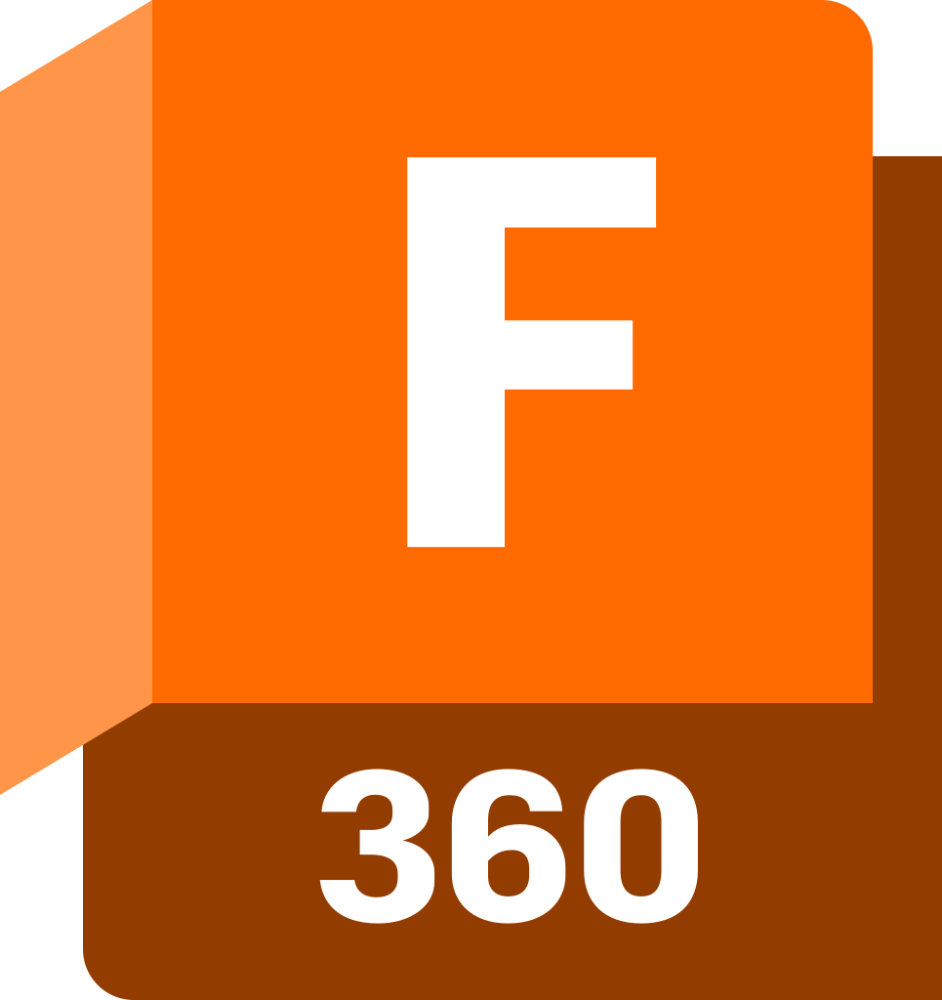

<h1 align="center">Hi, I'm Stijn 👋</h1>
<h3 align="center">Passionate thinkerer from Belgium</h3>

<h2 align="left">Connect with me</h2>

    
    
    

<h2 align="left">View my projects</h2>

    

<h2 align="left">Skills / Tools</h2>
<h3 align="left">Engineering</h3>

    
    
    
    
    
    

<h3 align="left">Programming</h3>

     
    
     
    
    
    
    

<h3 align="left">Extra</h3>

    
    
    

<h2 align="left">Support</h2>

    

  
